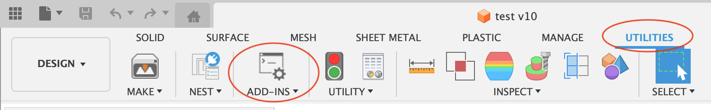
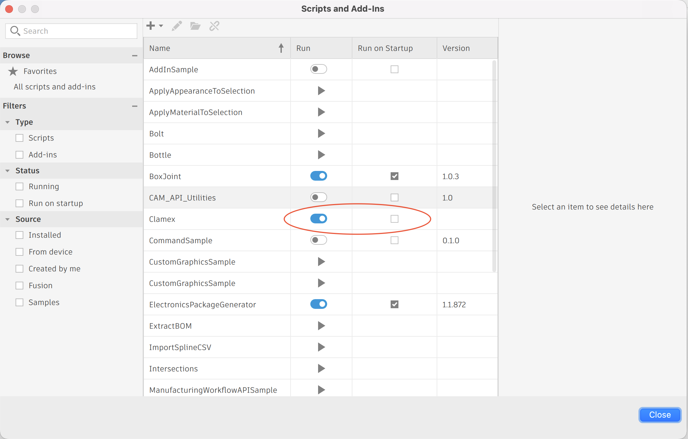
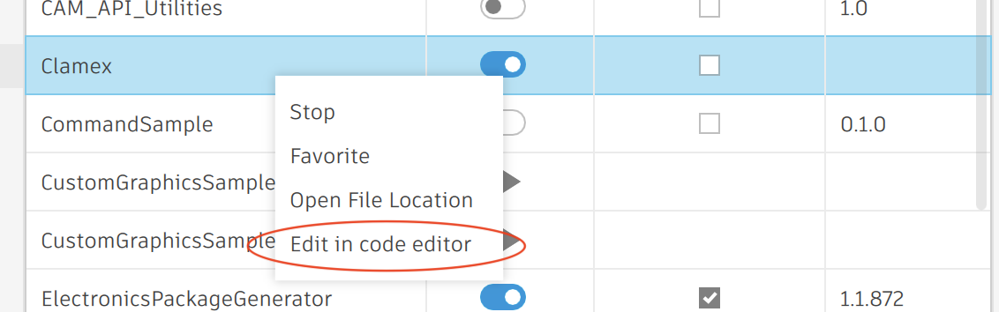

# Addins for Autodesk Fusion 360

This code is in alpha state and there are no guarantees that this will work correctly for your use case.
Furthermore, updates to this code might break existing usages of the addins.

## Installation

Just place the addins you want to use in your Fusion Addin directory. On the mac this is `~/Library/Application Support/Autodesk/Autodesk Fusion 360/API/AddIns`.

Then go Fusion's Addin panel:

In there you can run the addin by switching on the run toggle. Optionally, you can enable the run-on-startup checkbox, so that you don't have to repeat this process each time you launch Fusion.

## Development

To work on the addins, make sure you have VS Code installed, right-click on the plugin's name in Fusion's addin panel and choose "Edit in code editor".

