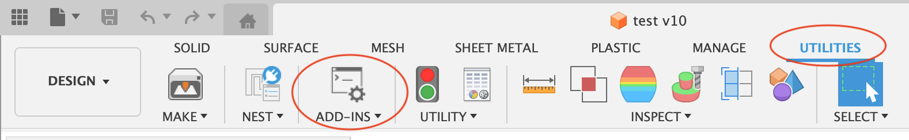
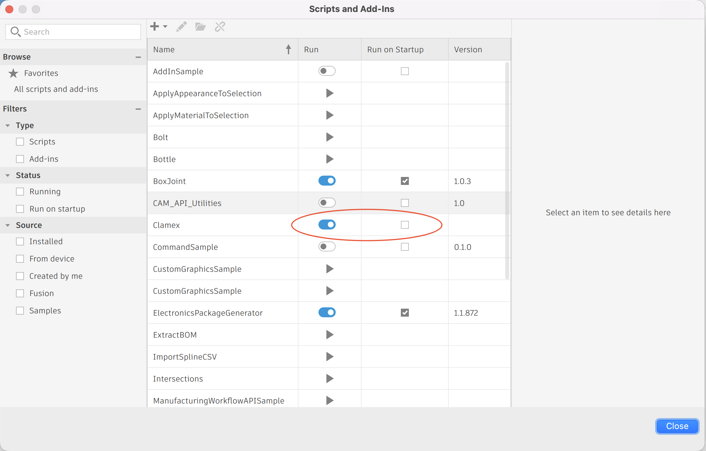
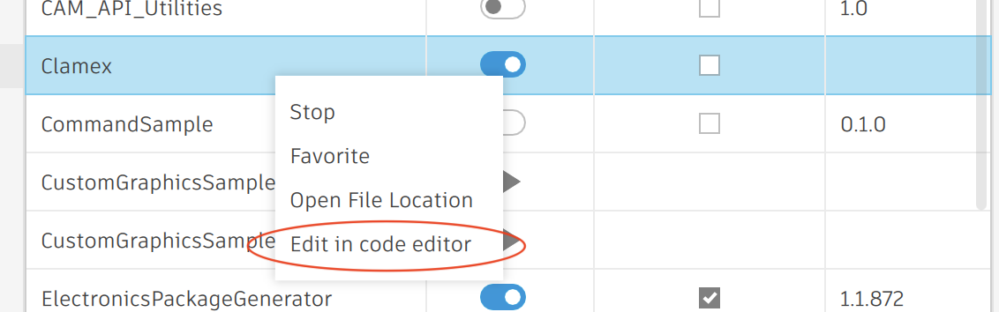

# Addins for Autodesk Fusion 360

This code is in alpha state and there are no guarantees that this will work correctly for your use case.
Furthermore, updates to this code might break existing usages of the addins.

## Addins

- **Lamello**

  This places the holes for Lamello Clamex and Cabineo connectors.
- **Sheet Good Tenons**

  Creates mortise and tenon connections between sheet good boards and also (optionally) places the holes for screw, Clamex or Cabineo connectors in one go.
- **Tenons (Native)**

  Creates fully constrained tenon, mortise, and dog-bone sketches with standard Fusion extrude and combine features. Select one straight joint edge, then position tenons by count with dimensioned equal spacing or by projected custom sketch points. Optional screw, Clamex, and Cabineo connector cuts use native features and reference the generated tenon geometry; mortise screw holes can be countersunk for countersunk-head screws. With the Domino tenon type it cuts Festool DOMINO slots into the mating board instead, with the same Domino options as Connector (Native) (sizes, machine end stops, fence heights, loose slots and reference marks), and places the connectors between the Dominos.
- **Pattern Cutouts**

  This is a collection of differently shaped pattern cutouts, e.g. triangles, rhombuses etc. The cutouts take existing inner features of the selected faces into account.

  The Froli pattern computes the best froli grid for a given rectangular surface and places cutouts accordingly.
- **Face Cutout (Native)**

  Creates a full inset cutout, a diagonal Cross, or a true-edge-spacing triangle pattern from one or more parallel planar faces using only native Fusion timeline features. The first selected face defines the shared sketches; each selected face gets its own start-to-opposite-face tool extrusion, while the user is responsible for choosing faces compatible with that shared layout. The Cross cuts four edge wedges and leaves two user-sized diagonal material bands. Existing inner face loops are preserved using a separate inner-feature inset and can be connected to the outer perimeter with material tabs. The triangle layout uses a fully constrained four-triangle seed sketch and a native solid rectangular pattern. An optional Align Triangles mode rounds the seed tips in the sketch and makes them tangent to adjacent baselines before the remaining solid edges are filleted. Rectangular faces can use an optional pattern axis; non-rectangular faces can use an axis plus two to four points that define an oriented pattern bounding box. An optional 45° chamfer (default 1 mm) breaks the cutout rims at the selected faces only; edges at the opposite face stay sharp, also on cutouts that go all the way through.
- **Concealed Hinge**

  This places holes for concealed hinges in the door and carcass boards. Currently there's just one type of hinge implemented (Blum cliptop 110 for thin doors).
- **Concealed Hinge (Native)**

  Creates the same door and carcass drilling patterns from one explicitly selected door edge and one explicitly selected carcass-board edge. The fully constrained door sketch uses linked projections of both edges, and the carcass sketch projects the door sketch to preserve hinge alignment. The result is a group of native Fusion sketches and cut extrudes without fixed sketch geometry; it does not use the custom feature API or automatically search for a matching carcass board.
- **Hatch Hinge**

  Places the holes for lift-up hatch hinges (Häfele Free space 1.11) in the hatch and the carcass side panels, from fully constrained sketches. Select the top edge of the closed hatch's inner face and the inner front edge of one or both side panels. The hinges are positioned from the underside of the carcass top: by default the top end of the first selected side panel edge (right when the top sits on the side panels); when the side panels run up past the top, select a point on the top's underside as Top Reference. Side panels get 3 × Ø5 mm holes with an adjustable depth: one sketch of circles on the first panel, cut into both panels by two extrudes (the second starts at the other panel's inner face, so both panels need flush front edges). The hatch gets pilot holes for the mounting plate screws. The add-in checks that the hatch top stays within the hinge's maximum overlap for the hatch thickness and opening angle, that the mounting plate fits on the hatch, and that no other body occupies the hinge's space.
- **Drawer Slides**

  Places the pre-drill holes for concealed drawer slides (Blum Movento 760H and 766H, Grass Dynapro 40 kg and 50/70 kg) in the carcass sides, as fully constrained sketches and flat-bottomed native hole features (2 mm × 4 mm by default). Select the front edge of each carcass side on the face the slide mounts to, and one horizontal edge, sketch line or point per slide at the height its runner rests on; the screw row is placed 38 mm above it, measured from the front edge as in the manufacturers' drilling tables. The holes are laid out on the first selected side; the other sides project that layout, so the runners always line up. Choose the slide and its nominal length, the number of holes per slide (spread evenly over the holes the runner offers) and the Odd or Even hole set: opposite sets on the two faces of a shared carcass board keep the screws from meeting. A Front Setback moves the slides back, e.g. for inset fronts.
- **Ball Catch**

  Places the pilot holes for Ganter GN 450 ball catches that hold an inspection hatch in its opening, as one fully constrained sketch and flat-bottomed native hole features (2 mm × 4 mm by default). The hatch is the piece milled out of the board, modelled as its own body in the opening. Select a straight edge of the opening on the face the catches are screwed to. The holders go on the frame, 8.4 mm outside the opening's contour; the balls go on the hatch, 9.4 mm inside it. Positioning by number shares the catches between the selected edge and the opposite one, and the selected edge gets the extra one when the number is odd. A single catch on an edge is centered; more run from the End Offset (measured from the ends of the edge's straight part) to the End Offset, evenly spaced. With Custom Points, each catch sits where its point projects perpendicularly onto the nearest straight edge of the opening, and it follows the point. The add-in checks that the slot is 2.5–3.5 mm wide, that the holders keep at least 14 mm from the ends of the straight edge, and that each part has its 15 mm mounting surface.
- **Door Latch**

  Places holes for door latches in the door and carcass boards. Currently this supports Everlocks and the small 44mm pull locks.
- **Door Latch (Native)**

  Creates the same Everlock and 44mm pull-lock drilling patterns as fully constrained sketches and native Fusion cut extrudes. Select exactly one door or drawer edge and the corresponding carcass-face edge; the add-in does not use the custom feature API or search for the carcass face automatically.
- **Dog Bones**

  Creates dog bones for inner corners based on the tool diameter. Specific edges or faces can be selected.
- **Dog Bones (Native)**

  Creates the same corner relief as a fully constrained sketch and a native cut extrude, without the custom feature API. Select either one planar face to process all eligible concave outer-loop corners, or one or more parallel concave edges on the same body.
- **Heal Sketch Lines**

  Connects sketch curves that should be connected but are not quite. This often happens when projecting or intersecting complex geometry from e.g. a vehicle model, so that the projected curves do not form a closed profile. This addin automatically heals these curves by placing coincident constraints for end points within a tolerance.
- **Flatten Design**

  Flattens a design hierarchy into the root component and deletes root-level bodies below a configurable size threshold.
- **Garbage Collect**

  Cleans up orphaned external combine/base/intersect features tracked by the shared combine module.
	
  If a custom feature is created in one component, but modifies bodies from other components, we have to create features external to the custom feature. If you then delete the custom feature, these external features will stay around. This addin can be used to garbage collect them.
- **Multi Combine**

  Applies one combine setup to multiple target bodies. Select one or more targets (bodies and/or component occurrences), one or more tools, and an operation (join/cut/intersect). The add-in expands target selections to bodies, creates one combine feature per target body, and always keeps tool bodies so they can be reused across all targets.

### Editing Results of the Native Add-Ins

Box Joint, Connector (Native), Tenons (Native), Face Cutout (Native), Concealed Hinge (Native), Hatch Hinge, Ball Catch, Door Latch (Native), Dog Bones (Native) and Drawer Slides can edit a result they created earlier. Select one of its sketches or features (in the expanded timeline group or in the browser), then start the add-in's command. The dialog opens with the original settings and the timeline rolled back to the result. OK rebuilds the result in place; Cancel leaves it unchanged.

- The edit is refused when later features use geometry the result created, e.g. a fillet on one of its cut edges, because rebuilding would delete them.
- Changes you made to the result's own sketch dimensions or feature parameters after creating it are overwritten. Box Joint is the exception: it reads its `boxJoint…` user parameters back.
- Results created before this feature existed cannot be edited.

## Installation

To install release builds, either copy add-in folders from `_build` manually into the Fusion Addin directory, or symlink the contents of `_build` into that directory. On macOS the AddIns folder is `~/Library/Application Support/Autodesk/Autodesk Fusion 360/API/AddIns`.

Before installing, refresh `_build`:

```bash
python3 tools/vendor.py
```

Then go Fusion's Addin panel:



In there you can run the addin by switching on the run toggle. Optionally, you can enable the run-on-startup checkbox, so that you don't have to repeat this process each time you launch Fusion.



## Defaults

Each add-in command provides two tabs:

- **Values**: normal command inputs.
- **Defaults**: configure persistent default values for that add-in.

On the **Defaults** tab, you can save defaults per input. Defaults can be either:

- Literal values (for example `20`, `true`, or a dropdown value id).
- Expressions (for example `thickness * 0.5`).

For dropdown inputs, hover over the **New default** field to see a tooltip with the available option names and their underlying value ids.

Expression defaults are evaluated by Fusion, so they can reference parameters from the active design. This makes it possible to define project-specific defaults driven by your model parameters.

Defaults are stored in one JSON file per add-in, in the parent folder of the add-in directories (typically the Fusion AddIns folder). The file name is the add-in id, e.g. `com_floriankugler_lamello.json`.

## Development

For live development from source:

```bash
tools/symlink_lib.sh
tools/symlink_addins.sh --dev
```

This links `addins-src/*` directly into Fusion and links each add-in's `lib/` to the shared repo `lib/`.

To work on the addins, make sure you have VS Code installed, right-click on the plugin's name in Fusion's addin panel and choose "Edit in code editor".



## Build System

Release artifacts are produced by `tools/vendor.py`.

What `vendor.py` does:

- Recreates `_build/` from scratch on each run.
- Copies each add-in from `addins-src/<addin>/` into `_build/<addin>_<addin_version>.<lib_version>/`.
- Renames `<addin>.manifest` and `<addin>.py` to include the same version suffix.
- Vendors the shared `lib/` folder into each built add-in.
- Writes `lib/__version__.py` inside each built add-in.
- Updates each built manifest's `version`.
- Updates each built manifest's `id`.

### Versioning

- Shared library version metadata lives in `lib/version.json`:
  - `version`: release version of shared library code (use an integer).
  - `interface_id`: breaking-change counter of the shared library interface.
- Each add-in has its own version metadata in `addins-src/<addin>/version.json`:
  - `version`: release version of that add-in (use an integer).
  - `interface_id`: breaking-change counter of that add-in's interface.
- Build folder/file suffixes use:
  `<addin version>.<lib version>`, for example `_7.3`.
- Built manifest `version` and vendored `lib/__version__.py` use:
  `<addin version>.<lib version>`, for example `7.3`.

### Breaking Changes and Add-in IDs

Fusion uses the manifest `id` to identify add-ins. The build system generates deterministic IDs that are strictly coupled to add-in and shared-lib interface epochs:

- Built ID format:
  `<base_manifest_id>_<addin_interface_id>.<lib_interface_id>`
- Example:
  `com.floriankugler.dogbones_2.1`

Operational rules:

- Breaking add-in interface change: increment that add-in's `interface_id`.
- Breaking shared-lib interface change: increment `lib/interface_id`.

Build command:

```bash
python3 tools/vendor.py
```

## License

GNU General Public License v3.0 or later

See [COPYING](COPYING) to see the full text.

## Attributions

- Lock icon by karl from [Noun Project](https://thenounproject.com/browse/icons/term/lock/) (CC BY 3.0)
- Hinage icon by Ruslan Dezign from [Noun Project](https://thenounproject.com/browse/icons/term/lock/) (CC BY 3.0)
- Triangular pattern icon by Made x Made from [Noun Project](https://thenounproject.com/browse/icons/term/lock/) (CC BY 3.0)
- Dog bone icon by shashank singh from <a href="https://thenounproject.com/browse/icons/term/dog-bone/">Noun Project</a> (CC BY 3.0)
